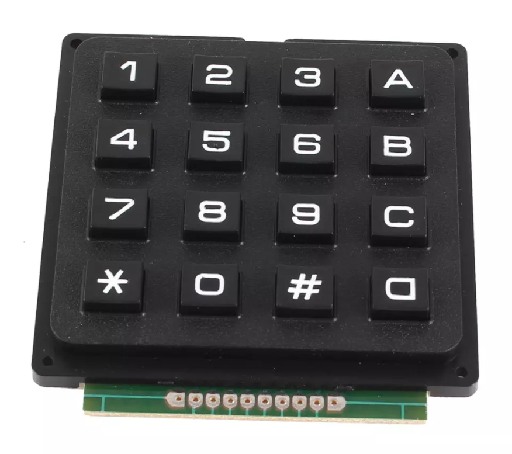
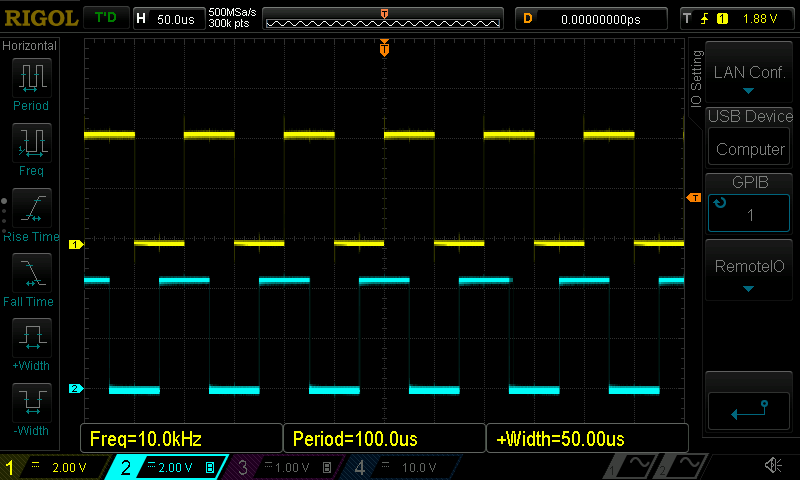

# pulseGenerator
***pulsGenerator*** based on ATmega328 using Timer1 interrupt

Firmware by Willem Aandewiel

## libraries used:
<pre>
https://github.com/Chris--A/Keypad
https://github.com/fdebrabander/Arduino-LiquidCrystal-I2C-library
</pre>

## platformio.ini
<pre>
  ; PlatformIO Project Configuration File
  ;
  ;   Build options: build flags, source filter
  ;   Upload options: custom upload port, speed and extra flags
  ;   Library options: dependencies, extra library storages
  ;   Advanced options: extra scripting
  ;
  ; Please visit documentation for the other options and examples
  ; https://docs.platformio.org/page/projectconf.html

  [platformio]
  workspace_dir   = .pio.nosync
  default_envs    = myBoard

  [env:myBoard]
  platform        = atmelavr
  board           = uno
  upload_protocol = usbtiny
  framework       = arduino
  monitor_speed   = 19200
  upload_speed    = 19200
  upload_port     = #select port like "/dev/cu.usbserial-3224144"
  build_flags     = 
	          -D DEBUG
  lib_ldf_mode    = deep+
  lib_deps = 
	          marcoschwartz/LiquidCrystal_I2C@^1.1.4
	          chris--a/Keypad@^3.1.1
            
  monitor_filters =
</pre>

## Optinal compile options
<code>#define _ALTERNATIVE_CONNECTIONS</code> for alternative connections

## Functions

### [0]-[9] .. +[A] Set single pulse mode
Set frequency of pulse-A and pulse-B to keyed-in number

example: 1200A -> sets frequency to 1200Hz

### [0]-[9] .. +[B] sets sweep from active frequency to keyed-in number
Set high sweep frequency

example: 5000B -> with first input (1200) will sweep from 1200Hz to 5000Hz in 5 seconds and back to 1200Hz

### [*]+[A] select potmeter as input
Selects potmeter as frequency input, cancelles sweep mode

### [C] Clear input, stop pulse
Pulse will stop, any input will be cleared

### [0]-[9] .. +[D] sets sweep time in seconds
Minimal sweep time is 3 seconds, maximum is 20 seconds

example: 8D -> sweep time set to 8 seconds

